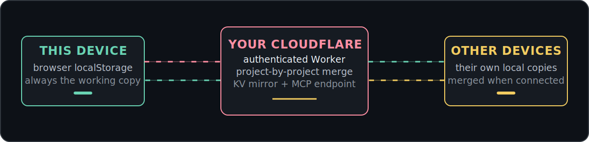
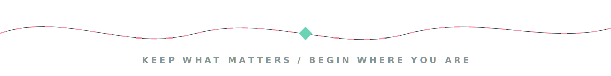

<p align="center">
  
</p>

<p align="center">
  <a href="./GUIDE.md"></a>
  
  <a href="./LICENSE"></a>
</p>


**The Vault is a Vale Atelier project:** a gentle project tracker for brains that lose track of what they love.

Everything you are making, from writing and crafts to code and tiny gardens, stays in one place so you do not have to hold it all in your head. Choose projects by the energy you actually have, break work into tiny steps, log even the smallest progress, and receive a little kindness when you finish something.

**No accounts. No tracking.** Your data lives in your browser, with optional sync through your own Cloudflare account.

> **Never touched a terminal?** The detailed [GUIDE.md](GUIDE.md) walks through setup and everyday use without assuming technical experience.

## Start where you are

<table>
  <tr>
    <td width="50%" valign="top">
      <h3>Just use the app</h3>
      <p>Open <code>the-vault.html</code> locally or host the static files anywhere. There is no build step, account, or server requirement.</p>
      <p><strong>Your projects stay in this browser.</strong> Export a JSON backup whenever you like.</p>
    </td>
    <td width="50%" valign="top">
      <h3>Add sync when you want it</h3>
      <p>Deploy the included Worker and KV namespace to your own Cloudflare account, then connect each device from the Sync menu.</p>
      <p><strong>Local-first stays local-first.</strong> The Worker mirrors and merges; it does not become the only copy.</p>
    </td>
  </tr>
</table>

## Made for real brains

| When you need... | The Vault gives you... |
| --- | --- |
| A choice that matches today | Low, medium, and high-energy filters plus **Pick for me** |
| One thing small enough to begin | A **next tiny step** on every project |
| Structure without pressure | Open-ended projects or step-by-step checklists |
| Proof that you did something | One-line progress logs, including the very small wins |
| A reason to come back | Optional **why this matters** notes and gentle celebrations |
| Less visual hunting | Search, status filters, sorting, and drag-and-drop order |
| A way out if anything changes | Full JSON backup and restore |
| A phone-friendly home | Home-screen installation on supported browsers |
| Help from an AI assistant | An optional authenticated MCP endpoint |

## Quick start without sync

The app is intentionally a single HTML file with no build process.

1. Download this repository or its ZIP archive.
2. Open `the-vault.html` in a browser.
3. Add your first project.
4. Export a backup from the three-dot menu whenever you want one.

To host it, publish `the-vault.html`, `manifest.json`, `logo-header.png`, and the `icon-*.png` files on any static host such as Cloudflare Pages, GitHub Pages, or Netlify.

## Optional cross-device sync

Sync uses the included Cloudflare Worker and a KV namespace in **your own account**.

Requirements: [Node.js](https://nodejs.org) 18+ and a free [Cloudflare account](https://dash.cloudflare.com).

```bash
cd vault-worker
npm install
npx wrangler login

# Create the KV namespace, then copy its id into wrangler.jsonc.
npx wrangler kv namespace create VAULT_KV

# Store a long, random token that protects your data.
npx wrangler secret put AUTH_TOKEN

# Deploy the Worker.
npx wrangler deploy
```

In the app, open the **three-dot menu > Sync** and enter:

- Your Worker URL, such as `https://vault-sync.your-subdomain.workers.dev`
- The same secret token on every device you want connected

Each project is merged independently, so editing one project on a phone does not overwrite unrelated work from a laptop. The newest edit for a project wins, deletions propagate through tombstones, and the app quietly checks for changes every 25 seconds while open.

## How sync fits

<p align="center">
  
</p>

## AI assistant integration

The same Worker exposes an authenticated MCP endpoint at `/mcp`. Compatible AI assistants can list projects, inspect details, add projects, log progress, manage steps, and mark work finished.

Use either:

- `https://<your-worker>.workers.dev/mcp` as the MCP server URL
- `Authorization: Bearer <your token>`
- `?secret=<your token>` for clients that cannot send custom headers

Treat that token like a password. It grants access to the contents of your synced Vault.

## Architecture

```text
the-vault.html          Single-file app with no build step
manifest.json           Home-screen metadata
icon-*.png              App icons
logo-header.png         In-app header logo
GUIDE.md                Beginner-friendly setup and usage guide
QUOTES.md               Sources for attributed celebration sayings
LICENSE                 MIT terms for code and original text
BRAND.md                Separate name, logo, and artwork terms
vault-worker/
  src/index.js          Sync API plus authenticated MCP endpoint
  wrangler.jsonc        Worker and KV configuration
```

## Privacy and cost

- **Local by default:** projects are stored in browser `localStorage`.
- **Optional sync:** synced data lives only in the Cloudflare account you deploy to.
- **No analytics or tracking:** the app does not create an account or send usage data elsewhere.
- **Free for personal use:** the Worker, KV reads, and 25-second polling pattern fit comfortably within Cloudflare's free tier for ordinary personal use.

## Guides, sources, and terms

- [GUIDE.md](GUIDE.md) for the complete no-jargon walkthrough
- [QUOTES.md](QUOTES.md) for celebration-message sources and notes
- [BRAND.md](BRAND.md) for the separate terms covering The Vault name, logo, and artwork

## Credits and license

Made with care by **Kit & Roman Vale** at **Vale Atelier**, July 2026.

The source code, documentation, and original text are released under the [MIT License](LICENSE). The name **The Vault**, its logo, and original artwork are separate brand assets covered in [BRAND.md](BRAND.md).

<p align="center">
  
</p>
